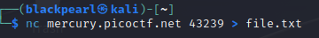
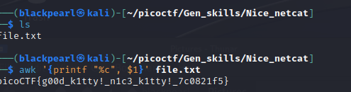

#NICE NETCAT

#Walkthrough:
Use the command: nc mercury.picoctf.net 43239 to interact 
with the shell. This will give you more info about the output

Save the output to a file

On examining the output, you can see that it is in ascii. 
Convert to characters using this command

awk '{printf "%c", $1}' file.txt

FLAG: picoCTF{g00d_k1tty!_n1c3_k1tty!_7c0821f5} 
