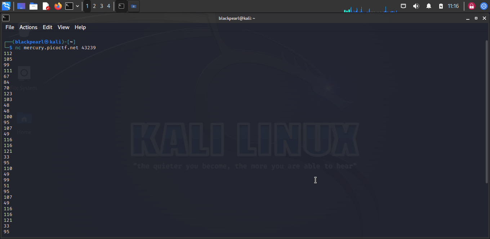

Description
There is a nice program that you can talk to by using this command in a shell: 
$ nc mercury.picoctf.net 43239, but it doesn't speak English...

Walkthrough:

Step 1: tpye the command: nc mercury.picoctf.net 43239 to get more info 
about the output

